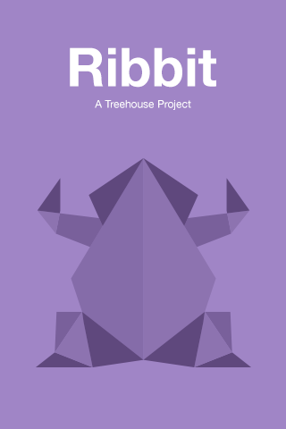

# [Ribit](https://teamtreehouse.com/projects/debug-and-extend-a-large-codebase)
###by Alexey Papin   

<h6>
You are being given a large legacy codebase. Some of the code will be quite familiar, some less so. This is quite intentional as we want you to practice the very common tasks of: debugging, deciphering unfamiliar code, researching documentation, and trying out new objects and frameworks.
Explicitly, your mission will be to fix and test X of the Y bugs listed below. If you would like to be eligible for a rating of “exceeds expectations”, you will also need to implement messaging with a real backend and update the app based on designs in the provided mockups. Remember, when you fix a bug, you are not simply trying to get rid of the symptom, but addressing the root cause of the bug. Be sure to leave comments in your code explaining how you tracked down and fixed each bug.
To "exceed expectations", you will also need to add several features to the app without compromising any existing functionality or code quality. The features to be implemented are described in detail below. Again, comments will be essential in explaining your additions and thinking.
</h6>

##Project Instructions

- [x] When you first launch the app all you will see is a black screen. There is a story board within the project with an initial view controller which should be displayed, but it is not. Display the initial view controller within the storyboard.
- [X] The login screen has an AutoLayout bug which shows up in the console log. Whenever the login screen is presented an error is displayed saying: "Unable to simultaneously satisfy constraints."
- [X] The FriendsViewController displays duplicate friends. Each friend should only be displayed once.
- [X] The EditFriendsViewController should show a checkmark next to usernames that are already friends.
- [X] Fix a memory leak in the app. 
Steps to reproduce the memory leak:
Run the app on a device and watch the memory report in Xcode
Select the Camera tab
Take a photo and then tap on "Use Photo"
Hit send button As you repeat steps 1 through 4 a few times you will notice that the memory usage of the app keeps going up. A memory leak is when memory is allocated for an object but not released appropriately. The object may no longer be pointing to the memory location however the memory is still allocated. Track down the leak and fix it. We have added a link to a helpful workshop under Project Resources, if you need it.
- [X] Remove deprecated APIs
As Apple introduces newer versions of the iOS SDK it also introduces new APIs retiring the old ones. The APIs that are no longer supported by the new version of the SDK are known as deprecated APIs. Upon building the app you will see in the issue navigator that there are yellow triangles warning you as a developer that the APIs are no longer available. Modify the app to use the latest version of the APIs. Once you implement the newer API the warnings will go away. Make sure that by implementing the new API you do not take away the functionality that existed previously.

###Extra Credit

- 1) Add a backend
The starter app serves as a prototype. It has all the makings of a fully functional app, however, but without a real backend, a messaging app is useless. Originally the app worked with a service called Parse which is no longer available. There are several options you have: you can implement your own Parse server or use an alternatives like: Firebase, back4app, or Sashido.. https://www.back4app.com or www.sashido.io

- 2) Implement missing features
Implement all the missing features: sign-up, login, sending an image, sending a video, deleting the image or video upon view, friends selection, forgot password.

- 3) Implement designs from mockups
Add design to the app based on the mockups provided. Other resources like app icon, launch and background images will be provided.
